# DEVELOPMENT OF SEMI-AUTOMATED PAPER-CHARCOAL BRIQUETTE PRODUCTION WITH GRAPHICAL USER INTERFACE

> **Bachelor of Science in Computer Engineering (BSCpE) Thesis Project**  
> **Faculty of Computer Engineering | Polytechnic University of the Philippines, Sta. Mesa, Manila**  
> _Target Field Deployment Area: Cavinti, Laguna, Philippines (Off-Grid Communities)_

---

## Executive Research Summary

This repository contains the complete cyber-physical system (CPS) architecture, mathematical calibration matrices, off-grid power sizing equations, and embedded firmware/software designs for the **Semi-Automated Paper-Charcoal Briquette Production System**.

Designed as a sustainable, community-scale waste-to-energy utility, this system intercepts municipal paper waste streams and residual charcoal fines, converting them into uniform, high-density, extended-burn solid fuel briquettes. Operating completely off-grid, the system utilizes a high-efficiency solar harvesting array and a closed-loop microcontroller pipeline, resolving the severe labor bottlenecks and quality inconsistencies inherent in traditional manual briquette production.

```
+---------------------------------------------------------------------------------------------------+
|                                 CIRCULAR ECONOMY VALUE CHAIN                                      |
|                                                                                                   |
|  [Lignocellulosic Waste] ---> Shred & Wetting ---> Hydrated Cellulose Fiber Activation (Binder)   |
|  [Charcoal Dust/Fines]   ---> Pulverization ---> High-Calorific Density Matrix                    |
|  [Off-Grid Solar PV]     ---> MPPT Charging  ---> 12V 30Ah LiFePO4 Battery Buffer                 |
|                                                                                                   |
|  ====> OUTPUT: Denser, uniform cooking briquettes with 2x burn duration of store-bought wood coal  |
+---------------------------------------------------------------------------------------------------+
```

---

## Repository Structural Map

This workspace organizes the theoretical research, mathematical sizing models, and empirical testing parameters:

| Document / Asset             | File Path                                                                                                                                                                                      | Description & Academic Scope                                                                                                                                                                                                                                                                                                                  |
| :--------------------------- | :--------------------------------------------------------------------------------------------------------------------------------------------------------------------------------------------- | :-------------------------------------------------------------------------------------------------------------------------------------------------------------------------------------------------------------------------------------------------------------------------------------------------------------------------------------------- |
| **Complete Thesis Chapters** | [GROUP 6 - SEMI-AUTOMATED BRIQUETTE PRODUCTION (4).md](<file:///c:/Users/User/CODERIST/mor/automated-charcoal-briq/chapters/GROUP%206%20-%20SEMI-AUTOMATED%20BRIQUETTE%20PRODUCTION%20(4).md>) | **Core Research Content:**<br/>• **Ch. 1:** Problem Setting, UN SDGs (Goal 7, 12, 13) alignment, Socioeconomic Context of Cavinti, Laguna.<br/>• **Ch. 2:** Thematic Literature, Biomass Densification, Cellulose Fiber Chemistry.<br/>• **Ch. 3:** Cyber-Physical specifications, core pin maps, sensor calibration, statistical treatments. |
| **Academic Thesis Document** | [GROUP 6 - SEMI-AUTOMATED BRIQUETTE PRODUCTION.pdf](file:///c:/Users/User/CODERIST/mor/automated-charcoal-briq/chapters/GROUP%206%20-%20SEMI-AUTOMATED%20BRIQUETTE%20PRODUCTION.pdf)           | Original publication-ready thesis containing high-resolution mechanical CAD renders and complete PCB schematics.                                                                                                                                                                                                                              |
| **System Blueprint & Guide** | [README.md](file:///c:/Users/User/CODERIST/mor/automated-charcoal-briq/README.md)                                                                                                              | This master documentation file, detailing system architecture, calibration code, and deployment steps.                                                                                                                                                                                                                                        |

---

## Material Science: Cellulose Adhesion & Mix Design

The mechanical strength of the briquettes relies on **100% chemical-free adhesion**, completely removing the need for costly starch binders or toxic synthetic glues.

```
CELLULOSE FIBER WETTING, SWELLING, AND HYDROGEN BOND FORMATION

Dry Paper Fiber          Soaked & Hydrated           Compacted & Dried
[ -OH ... HO- ]  ===>   [ -OH  (H2O)  HO- ]  ===>    [ -OH-O-H ... O-H-O- ]
Intra-chain H-bonds      Fiber Swelling/Libration     Inter-chain H-bonds
(Crystalline)             (Amorphous Activation)       (Mechanical Interlock)
```

- **Cellulose Fiber Swelling:** Wetting Kraft-pulp paper activates its amorphous cellulose chains. Under mechanical compression, these fibers swell, interlock, and form tight inter-chain hydrogen bonds with adjacent carbon particles upon drying.
- **Water Retention Value (WRV):** Kraft paper holds a WRV of **$1.0 - 1.2$**, retaining moisture even under moderate mechanical pressure.
- **Water Holding Capacity (WHC):** Residual charcoal fines hold a WHC of **$2.0 - 3.0$**.
- **Volumetric Mixture Ratios:** To yield a **$1:1$ dry-weight ratio**, the initial wet mixture is prepared within a wet mass ratio of **$1.0 : 1.0 : 3.0$ to $1.0 : 1.0 : 4.2$** (Charcoal : Paper : Water).

### Evaluated Composition Matrix (Dry-Weight Ratios)

- **10:90 Formulation:** Minimal binder threshold. Extreme calorific output, but prone to mechanical shattering during transport.
- **20:80 Formulation (Recommended):** The optimal balance of thermodynamic output and structural durability.
- **30:70 Formulation:** High durability blend. Slower burn rate due to dense cellulose matrix alignment.

---

## Cyber-Physical System (CPS) Architecture

```mermaid
graph TD
    subgraph ControlLayer [Control Layer]
        MCU[ESP32-WROOM-32D Dual-Core MCU]
        Nextion[Nextion 4.3in HMI Touch Screen]
        SD[SPI Micro-SD Logging Module]
        PWA[LittleFS React PWA Hotspot]
        MCU <--> Nextion
        MCU <--> SD
        MCU <--> PWA
    end

    subgraph SensoryLayer [Sensory and Telemetry Layer]
        Flow[YF-S201 Flow Sensor]
        LoadCell[HX711 Strain Gauge Load Cell]
        Level[XK-Y25 Capacitive Sensor]
        DS18B20[DS18B20 Temp Probe Array]
        DHT22[DHT22 Exhaust Humidity Sensor]
        Interlock[Roller-Lever Safety Switches]
    end

    subgraph MechanicalLayer [Mechanical Actuation Layer]
        Actuator[4000N Linear Compaction Ram]
        Grinder[775 High-Speed Pulverizer]
        Mixer[Planetary Geared Mixer 60 RPM]
        Solenoid[Water Solenoid Valve]
        Vibrator[ERM Slurry-Settling Vibrator]
        Curing[50W Halogen Array and Fan]
    end

    MCU -- Pulse Interrupts --> Flow
    MCU -- Digital Strain --> LoadCell
    MCU -- Proximity Logic --> Level
    MCU -- Dallas 1-Wire Bus --> DS18B20
    MCU -- Calibrated RH --> DHT22
    MCU -- Safety Ground Loop --> Interlock

    MCU -- BTS7960 PWM --> Actuator
    MCU -- Isolated Relays --> Grinder
    MCU -- Isolated Relays --> Mixer
    MCU -- Isolated Relays --> Solenoid
    MCU -- Isolated Relays --> Vibrator
    MCU -- Isolated Relays --> Curing
```



### Component Specifications (Table 2 - 5 Mapping)

#### 1. Central Processing & HMI Interfacing

- **Microcontroller:** Dual-Core 32-bit Tensilica Xtensa ESP32-WROOM-32D ($240\text{ MHz}$). Core 0 runs high-speed sensor interrupts and safety watchdogs; Core 1 schedules local Wi-Fi AP networking and WebSocket telemetry.
- **Smart HMI Panel:** Nextion Discovery 4.3" capacitive touch screen with onboard memory and independent graphics processor, communicating via asynchronous Hardware UART.
- **Edge Data Logger:** SPI Micro-SD Card module writing continuous binary arrays to a physical FAT32 partition.

#### 2. Power Infrastructure (Autonomous Off-Grid)

- **Solar Array:** 100W Monocrystalline PV panel delivering continuous power under varying irradiance.
- **Charge Controller:** 10A Intelligent MPPT Solar Regulator.
- **Battery Storage:** 12V 30Ah Lithium Iron Phosphate ($LiFePO_4$) bank chosen for high cycle life, thermal stability, and current discharge capacity.
- **Logic Rails:** Dual LM2596S DC-DC step-down buck converters providing isolated, stable $5\text{V}$ and $3.3\text{V}$ logic lines.

#### 3. Electromechanical Actuators & Fluidics

- **Compression Ram:** Heavy-duty linear actuator delivering up to $4000\text{N}$ of linear force, driven by a high-current BTS7960 H-bridge driver.
- **Pulverizer:** High-speed 12V 775 motor.
- **Agitator:** Low-speed, high-torque planetary geared motor ($60\text{ RPM}$).
- **Water Valve:** 12V Solenoid fluid valve + motorized brass ball valve to automatically purge excess compaction fluid.
- **Settling Array:** 12V ERM vibration motor providing high-frequency vibrations to eliminate air bubbles in the mold.
- **Thermal Curing Enclosure:** Forced-air curing cabinet featuring a 50W short-wave infrared halogen lamp array and a brushless DC exhaust blower.

---

## Sensor Calibration & Mathematical Models

The system relies on high-accuracy calibration curves configured in the microcontroller firmware to translate raw electrical signals into physical units:

### 1. YF-S201 Water Flow Sensor

Integrates digital pulse counts over time to calculate volumetric water infusion:
$$V_w = \sum_{i=1}^{P} \frac{1}{C_{\text{flow}}}$$

- **Flow Rate Calibrated Constant ($C_{\text{flow}}$):** **$450.0\text{ pulses/Liter}$** ($R^2 = 0.9982$, derived through gravimetric control testing).
- **Flow Velocity Equation:**
  $$Q_{\text{actual}} = 0.00222 \cdot f + 0.015 \text{ (L/min)}$$
  _(where $f$ represents pulse frequency in Hz)._

### 2. Compaction Load Cell (HX711)

Converts 24-bit digital ADC inputs from the S-type strain gauge load cell into linear force ($F$):
$$F\text{ (N)} = \left( \frac{ADC_{\text{raw}} - 142,500}{22,480.0} \right) \times 9.80665$$

- **Scale Factor:** **$22,480\text{ LSB/kg}$** ($R^2 = 0.9999$).
- **Compaction Threshold:** The firmware triggers linear actuator retraction immediately upon reaching **$2000.0\text{ N}$** of force, matching a compaction pressure of $400.0\text{ kPa}$ over the $10\times5\text{ cm}$ mold surface.

### 3. DHT22 Humidity Polynomial Correction

Compensates for humidity drift caused by high thermal levels inside the curing chamber:
$$\text{RH}_{\text{calibrated}} = a_3 \cdot \text{RH}_{\text{raw}}^3 + a_2 \cdot \text{RH}_{\text{raw}}^2 + a_1 \cdot \text{RH}_{\text{raw}} + a_0 + \beta \cdot (T_{\text{sensor}} - 25.0)$$

- **Calibration Constants:**
  - $a_3 = -2.13 \times 10^{-5}$
  - $a_2 = 3.84 \times 10^{-3}$
  - $a_1 = 0.892$
  - $a_0 = 1.450$
  - $\beta = -0.054\text{ RH/}^\circ\text{C}$
- **Target Accuracy:** Limits standard error to **$\pm 1.8\%$ RH**. The exhaust fan shuts down automatically when relative humidity hits **$\leq 15\%$**, signaling drying cycle completion.

---

## Solar Power Budgeting & Sizing Equations

The energy harvesting system was designed around mathematical power budgets to guarantee continuous, off-grid self-sufficiency:

### 1. Daily Electrical Consumption Sizing

- **Logic Draw (ESP32, screen, sensors):** $2.5\text{ W} \times 8\text{ hr} = 20.0\text{ Wh}$
- **Actuator Power Per 10-Batch Run:**
  - _Water Valve:_ $3.2\text{ Wh}$
  - _Pulverizer Motor:_ $30.0\text{ Wh}$
  - _Geared Slurry Mixer:_ $30.0\text{ Wh}$
  - _Compression Actuator:_ $4.0\text{ Wh}$
  - _IR Thermal Drying:_ $166.7\text{ Wh}$
  - _Exhaust Ventilation:_ $8.0\text{ Wh}$
- **Cumulative Daily Load ($E_{\text{total}}$):** **$261.9\text{ Wh}$**

### 2. Battery Storage Capacity Sizing ($LiFePO_4$)

Calculated with a safety factor ($S_f = 1.2$) and an $80\%$ depth of discharge ($DoD$) limit:
$$C_{\text{batt}} = \frac{E_{\text{total}} \times S_f}{V_{\text{sys}} \times DoD} = \frac{261.9\text{ Wh} \times 1.2}{12.8\text{ V} \times 0.8} \approx 30.7\text{ Ah} \implies \text{\bf 12V 30Ah LiFePO4 Battery Pack}$$

### 3. Solar PV Panel Sizing

Based on local peak sun hours ($H_{\text{peak}} = 4.0\text{ hours}$) and system loss coefficient ($\eta_{\text{sys}} = 0.75$):
$$P_{\text{PV}} = \frac{E_{\text{total}}}{H_{\text{peak}} \times \eta_{\text{sys}}} = \frac{261.9\text{ Wh}}{4.0\text{ hours} \times 0.75} \approx 87.3\text{ W} \implies \text{\bf 100W Monocrystalline PV Panel}$$

---

## Quantitative Verification Framework

To systematically evaluate the mechanical, thermal, and software interfaces, the following empirical formulas are used:

- **Mean Burn Duration (Thermal Longevity):**
  $$\bar{x} = \frac{\sum_{i=1}^{n} x_i}{n}$$
- **Compaction Consistency (Output Dimensional Deviation):**
  $$\sigma = \sqrt{\frac{\sum_{i=1}^{n} (x_i - \bar{x})^2}{n}}$$
- **Briquette Production Rate (Units per Hour):**
  $$R = \frac{U}{T}$$
- **Labor Reduction Index (Percentage Man-Hour Reduction):**
  $$\%\text{ Reduction} = \frac{T_{\text{manual}} - T_{\text{semi-automated}}}{T_{\text{manual}}} \times 100$$
- **Shatter Resistance Index (Briquette Durability):**
  $$\%\text{ Weight Loss} = \frac{W_i - W_o}{W_i} \times 100$$
  _(where $W_i$ is initial weight and $W_o$ is the weight of the largest solid piece surviving a 1-meter drop test onto concrete)._

---

## Build & Deployment Instructions

### 1. ESP32 Firmware Installation

Ensure you have **PlatformIO** installed on VS Code, then:

- Add libraries: `OneWire`, `DallasTemperature`, `Adafruit INA219`, `HX711`.
- Connect the ESP32 dev board via USB.
- Run the command:
  ```bash
  pio run --target upload
  ```

### 2. Nextion HMI Visual Flash

- Open the Nextion HMI screen layout file using the **Nextion Editor**.
- Compile the layout to generate the binary `.tft` file.
- Copy the `.tft` file to a standard FAT32-formatted Micro-SD Card.
- Insert the SD card into the Nextion screen slot, power on the display, and wait for the flashing process to complete.

### 3. PWA Web Interface Upload

The local Progress Web App (PWA) is hosted directly on the ESP32’s internal LittleFS partition:

```bash
# Navigate to web dashboard source
cd webapp

# Compile PWA assets
npm install && npm run build

# Flash LittleFS partition to ESP32
pio run --target uploadfs
```

---

## Safety Protocols & Multiple Constraints

1.  > [!IMPORTANT]
    > **Human-in-the-Loop Safeguard:** The machine is strictly _semi-automated_. For safety, the operator must manually load the dry inputs into the hoppers and physically trigger the next phase using the touch screen graphical interface.
2.  > [!WARNING]
    > **Material Restriction:** The system lacks chemical filtering mechanisms. Only water-soluble impurities can be extracted; synthetic elements (e.g., plastic elements or ink solvents in paper) remain in the briquette.
3.  > [!CAUTION]
    > **High-Pressure Compaction Interlock:** The enclosure is protected by active ground-loop limit switches. If opened, all electromechanical drivers are shut down within **19.2 ms** to protect the operator.
4.  > [!IMPORTANT]
    > **Power Boundary:** The system runs entirely off-grid. It must draw its operational power exclusively from the solar PV array and battery bank.

---

> 🎓 **Academic Proponents & Citation:**  
> Developed by the Computer Engineering research team at the Polytechnic University of the Philippines:  
> **Gero B. Añonuevo, Gerald R. Berongoy, Marco Gabriel P. Galdiano, and Jester Carl C. Tiedra.**  
> Under the guidance and supervision of the **Faculty of Computer Engineering, PUP Sta. Mesa, Manila.**
